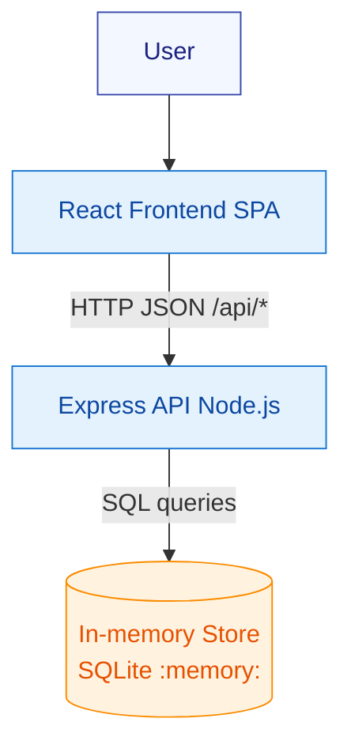
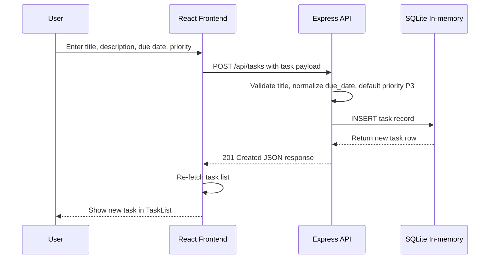

# Cloud Architecture Overview

A simple system context for the TODO monorepo:
- React frontend (SPA) in `packages/frontend`
- Express API in `packages/backend`
- In-memory data store using SQLite (`better-sqlite3`) with `:memory:` DB

- Frontend dev server: `http://localhost:3000` (proxy to backend via `proxy` in `packages/frontend/package.json`)
- Backend API server: `http://localhost:3030`
- Primary endpoints: `/api/tasks` (GET, POST), `/api/tasks/:id` (GET, PUT, PATCH, DELETE)

## Sequence: Create a TODO

